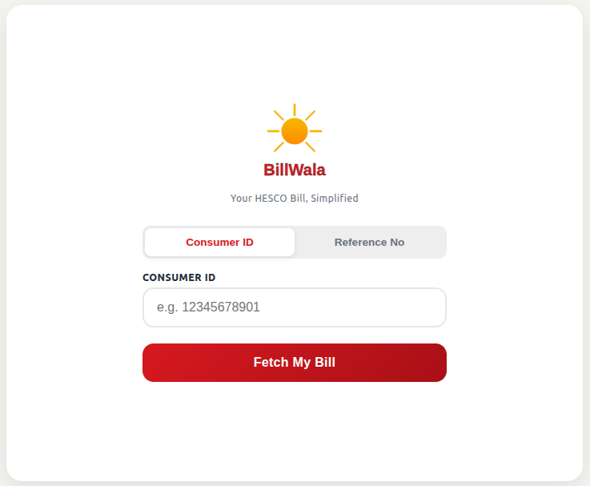

# BillWala

BillWala simplifies the HESCO electricity bill and helps both technical and non-technical users to evaluate their bills accurately and easily.



Production link: [BillWala App](https://your-production-link.com)

## Features
- Simplifies complex HESCO bill formats into easy-to-understand summaries
- Provides clear breakdown of charges, taxes, and fees
- Helps users identify discrepancies or unusual consumption patterns
- Offers historical bill comparison and trends
- User-friendly interface accessible to all technical levels
- Accurate bill calculation and validation
- Mobile-responsive design for on-the-go access

## Setup
1. Clone the repository:
   ```bash
   git clone https://github.com/your-username/BillWala.git
   ```
2. Navigate to the project directory:
   ```bash
   cd BillWala
   ```
3. Install dependencies:
   ```bash
   pip install -r requirements.txt
   ```
4. Set up environment variables:
   - Copy `.env.example` to `.env`
   - Fill in required `ANTHROPIC_API_KEY`
5. Run the application:
   ```bash
   python main.py
   ```

## Requirements
- Python 3.8+
- Dependencies listed in `requirements.txt`
- Internet connection for API services

## Contributing
If you find **BillWala** helpful, please consider giving it a star! Contributions are welcome — feel free to submit pull requests or open issues to improve the project.